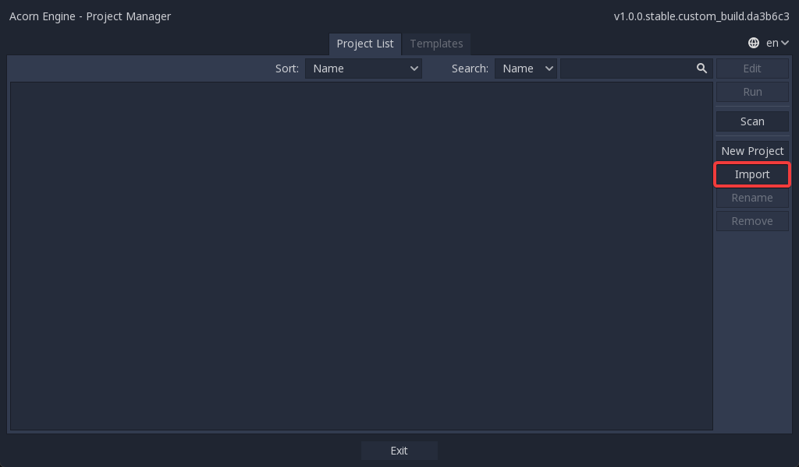
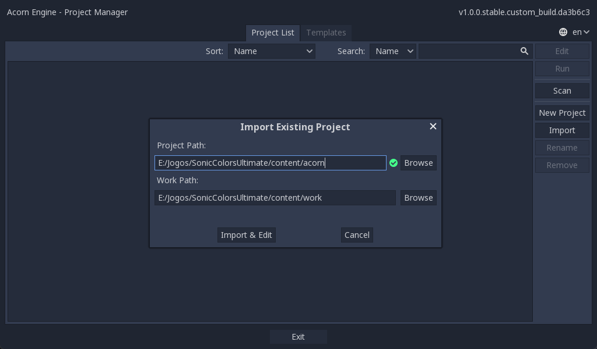

# Acorn Engine
Modified Godot to have better support for Sonic Colours: Ultimate.

# Current features
- Version number was changed to 1 due to being Blind Squirrel Engine v1 and not Godot v3
- cast_shadow's default was changed from On to Off
- cast_character_shadow has been added
- Support for importing projects from PCKs, while saving edited files in a specified "work" folder. Said folder also takes priority over files in PCKs.

# How to Import a specific Blind Squirrel PCK Project
- Download [SCU_GDScript.7z](https://github.com/hedge-dev/godot-bse/releases/latest/download/SCU_GDScript.7z) and extract it to a folder in your computer. This will be your "work" folder.
- Download the latest release from [Releases](https://github.com/chloezamorano/godot-bse/releases/latest) and run the editor binary. Currently there's only one Linux binary, tested on KDE Neon.
- In the Project Manager, select Import.

- Select `sonic0.pck` as the project path, and use the folder you previously created as the work folder. The work folder will be where you will place your modified files, alongside the decompiled scripts you downloaded.

- Finally, press "Import and Edit" to finish the process!

# Compiling godot-bse
If you want to contribute or you just wanna build it yourself for whatever reason, here's how:
- Download [SCons](https://scons.org/) for the platform you wish to compile on.
- Then, in the folder of the project, run the `scons` command, here's some of the options you'll want to use:
    - `-jn`: Build using `n` amount of threads, this will speed up the process with multithreading. Replace the n by a number, it must be equal or lower to the amount of threads your CPU has, and greater than zero. For me it's usually `-j4`.
    - `platform=p`: Build for a certain platform. Replace the p after the sign with a platform. You can use `platform=list` to see the platforms available in your system. On Linux you'll have the options of `server` and `x11` (For this fork of Godot, use `x11`, `server` is useless for this use case.)
    - `optimize=l`: Optimization level. Replace `l` by a value, it can be `speed`, `size` or `none`.
    - `tools=o`: Whether you're compiling with the tools for the engine. Replace `o` with yes or no. For this use case you're always gonna want to enable them.
    - There's more options but these are the ones you'll usually want to use, for more information you can look into the official guide to compiling base Godot, though the guides for versions ahead of 3.3 won't be an exact match.
- Just wait, and you'll get a binary at `./bin` that you can just run as-is!
